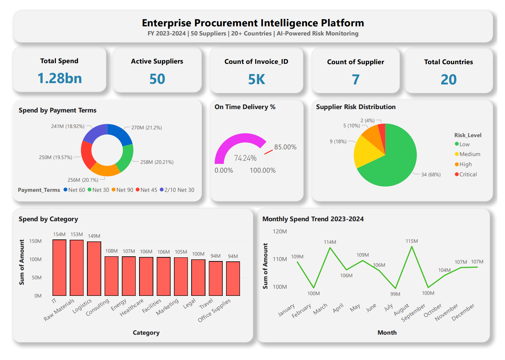
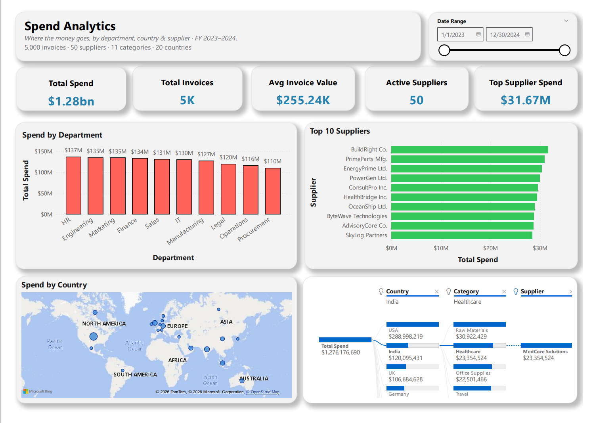
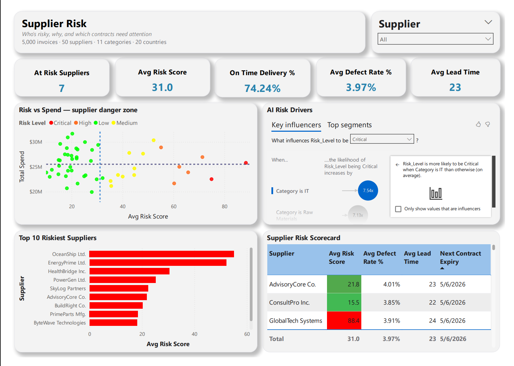
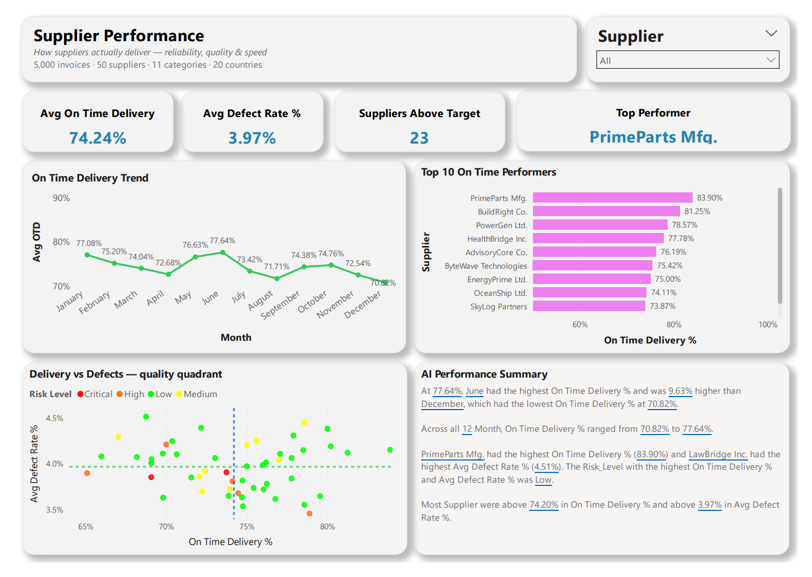
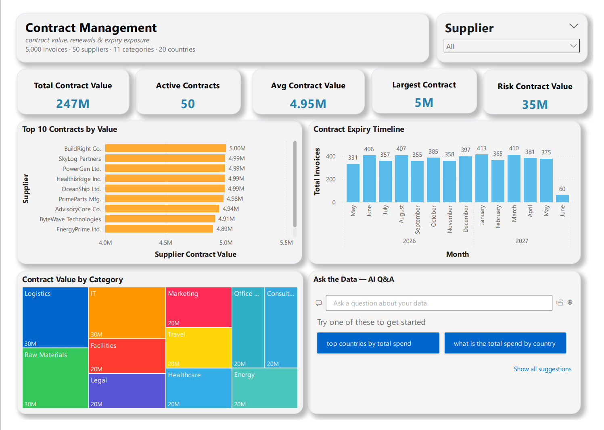
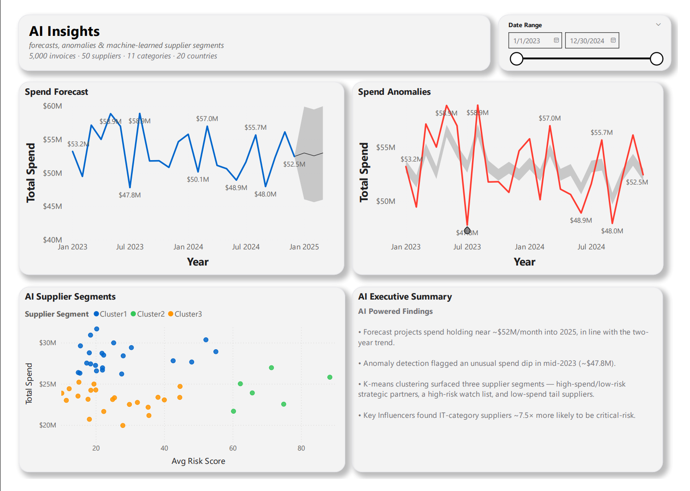

# Enterprise Procurement Intelligence Platform

**An AI-powered spend analytics and supplier risk dashboard built in Power BI.**

A six-page, end-to-end procurement analytics solution analyzing **$1.28B in spend** across **50 suppliers, 20 countries, and 11 procurement categories**. Built as a portfolio project to demonstrate data modeling, DAX, and Power BI's AI/ML capabilities applied to real procurement workflows.

**Tech stack:** Power BI Desktop · DAX · Python (synthetic data generation)

---

## Project Overview

This dashboard turns a raw 5,000-row procurement dataset into an executive-ready decision tool. It answers the questions a procurement team actually asks: Where is our money going? Which suppliers are risky, and why? Who delivers reliably? What is our contract exposure? And what does the data predict next?

The project emphasizes **trustworthy numbers** (careful data modeling and de-duplication), **clear visual storytelling** (a consistent design system across all pages), and **breadth of Power BI's AI features** (seven distinct AI/ML capabilities across the report).

---

## The Dashboard, Page by Page

### Page 1 — Executive Summary

The landing page: a one-glance health check of the entire procurement function for leadership.

- **Five KPI cards:** Total Spend ($1.28B), Active Suppliers (50), Total Invoices (5K), High-Risk Suppliers (7), and Countries (20).
- **Spend by Payment Terms** (donut) — how spend splits across Net 30/45/60/90 and 2/10 Net 30.
- **On-Time Delivery gauge** — actual on-time rate (74.2%) measured against an 85% target, instantly showing the performance gap.
- **Supplier Risk Distribution** (pie) — the split of suppliers across Critical / High / Medium / Low risk.
- **Spend by Category** (column) — all 11 categories ranked by spend.
- **Monthly Spend Trend** (line) — spend movement across FY2023–2024.

### Page 2 — Spend Analytics

Drills into *where the money goes* — by department, geography, and supplier.

- **Five KPI cards:** Total Spend, Total Invoices, Average Invoice Value ($255K), Active Suppliers, and Top Supplier Spend ($31.67M).
- **Spend by Department** (column) — which internal teams drive spend.
- **Top 10 Suppliers** (bar, Top-N filter) — supplier concentration at a glance.
- **Spend by Country** (bubble map) — geographic distribution of spend.
- **AI Decomposition Tree** — automatically surfaces the highest-spend paths across country, category, and supplier (AI feature #1).

### Page 3 — Supplier Risk

Identifies *which suppliers are risky and why*.

- **Five KPI cards:** At-Risk Suppliers (Critical + High), Average Risk Score, Average On-Time %, Average Defect %, and Average Lead Time.
- **Risk vs Spend "danger zone" scatter** — every supplier plotted by risk against spend, split into quadrants by average lines, with bubbles colored by risk level. The top-right quadrant (high risk + high spend) is the watch list.
- **AI Key Influencers** — machine learning explains what drives high risk, surfacing that IT-category suppliers are roughly **7.5x more likely** to be critical-risk (AI feature #2).
- **Top 10 Riskiest Suppliers** (red bar, Top-N).
- **Supplier Risk Scorecard** — a conditional-formatted table combining risk score, on-time %, defect %, lead time, and contract expiry into a single heat map.

### Page 4 — Supplier Performance

Benchmarks *who actually delivers* — reliability, quality, and speed.

- **Five KPI cards:** Average On-Time %, Average Defect %, Average Lead Time, Suppliers Above Target, and Top Performer (by name).
- **On-Time Delivery Trend** (line) with an 85% target reference line.
- **Top 10 On-Time Performers** (bar, Top-N).
- **Delivery vs Defects quality quadrant** (scatter) — the ideal supplier sits bottom-right (high on-time, low defects); bubble size reflects spend.
- **AI Smart Narrative** — auto-written, filter-responsive performance insights (AI feature #3).

### Page 5 — Contract Management

Tracks *contract value, renewals, and exposure*.

- **Five KPI cards:** Total Contract Value ($247M, de-duplicated), Active Contracts (50), Average Contract Value ($4.95M), Largest Contract, and At-Risk Contract Value (~$35M tied to high-risk suppliers).
- **Top 10 Contracts by Value** (bar, Top-N).
- **Contract Expiry Timeline** (column) — the renewal pipeline by month.
- **Contract Value by Category** (treemap) — where contract value concentrates.
- **AI Q&A** — ask the data plain-English questions and get instant visual answers (AI feature #4).

### Page 6 — AI Insights

The capstone — Power BI's machine-learning features applied to the full dataset.

- **Spend Forecast** — a time-series projection of monthly spend with a confidence band (AI feature #5).
- **Spend Anomalies** — anomaly detection that auto-flags unusual spend months and explains the drivers (AI feature #6).
- **AI Supplier Segments** — K-means clustering that auto-discovers supplier groups, mapped to Kraljic-style strategic-sourcing segments (AI feature #7).
- **AI Executive Summary** — a curated text panel surfacing the report's headline AI-driven findings.

---

## AI & Machine Learning Features

Seven distinct Power BI AI capabilities across the report:

| Feature | Page | What it surfaces |
|---|---|---|
| Decomposition Tree | Spend Analytics | Auto-finds the highest-spend dimension paths |
| Key Influencers | Supplier Risk | Drivers of high risk (IT suppliers ~7.5x more likely critical-risk) |
| Smart Narrative | Supplier Performance | Auto-written, filter-responsive insights |
| Q&A | Contract Management | Natural-language querying of the data |
| Forecasting | AI Insights | Time-series projection with a confidence band |
| Anomaly Detection | AI Insights | Auto-flags unusual months with explanations |
| K-means Clustering | AI Insights | Discovers supplier segments |

---

## Key Technical Highlights

- **20+ DAX measures** powering dynamic KPIs: total/average spend, supplier concentration, risk scoring, on-time-target benchmarking, and Top-N ranking.
- **Robust data modeling** — de-duplicated contract valuation using `SUMX`/`MAX` patterns to prevent invoice-level double-counting; `COALESCE` to convert blank KPIs to meaningful zeros; column assumptions validated before building.
- **Top-N filtering** to surface the most material suppliers and contracts.
- **Synced slicers** carrying a supplier selection consistently across the risk, performance, and contract pages.
- **Consistent design system** — 1280x900 canvas, Segoe UI, white card layout with rounded borders, applied uniformly across all six pages.

---

## The Data

5,000 rows of realistic synthetic procurement data generated in Python (Faker library), spanning FY2023–2024, with 16 columns: invoice details, supplier, category, country, department, amount, payment terms, on-time delivery, defect rate, lead time, risk score and level, and contract value and expiry.

*All data is synthetic and contains no real or confidential information.*

---

## How to View

- **Quick look:** open `Procurement_Intelligence_Platform.pdf` for a full static walkthrough of all six pages.
- **Interactive:** download `Procurement_Intelligence_Platform.pbix` and open it in [Power BI Desktop](https://powerbi.microsoft.com/desktop/) (free).
- **Raw data:** `procurement_data.csv`.

---

## Files in This Repository

| File | Description |
|---|---|
| `Procurement_Intelligence_Platform.pbix` | The Power BI dashboard (open in Power BI Desktop) |
| `Procurement_Intelligence_Platform.pdf` | Static export of all six pages |
| `procurement_data.csv` | The 5,000-row synthetic dataset |
| `01_executive_summary.png` … `06_ai_insights.png` | Page screenshots |
| `README.md` | This file |

---

## About

Built by **Harsh Patel** as a portfolio project.

- LinkedIn: https://www.linkedin.com/in/harshpatel510/
